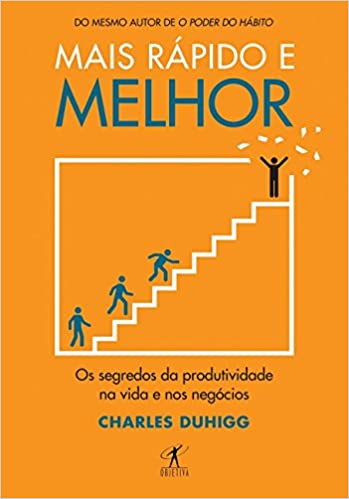

Alguns creem que enxergar seus colegas de faculdade ou de profissão como concorrentes seja uma boa fagulha de motivação. Seja aquele primeiro lugar da sala, ou seus parceiros da empresa que o superam em habilidades e conhecimento: seguir seus passos e provar ser melhor que eles parece ser um caminho para o sucesso e um bom combustível para a própria evolução. Mas quais as consequências dessa postura? Trago aqui ideias de Simon Sinek e Charles Duhigg e aplico a esta questão.

## Jogos infinitos

[Neste trecho](https://www.youtube.com/watch?v=KbYzF6Zy5tY) de uma palestra fantástica do Simon Sinek, ele comenta sobre duas posturas antagônicas de empresas: há aquelas que jogam um **jogo finito** e as que sabem que estão num **jogo infinito**.

Esses "jogos" são interpretações de conceitos de Teoria dos Jogos aplicados ao mundo corporativo. Um jogo finito, Simon explica, é aquele com as seguintes características: todos os jogadores são conhecidos, as regras são fixas e há um objetivo final com o qual todos concordam. Um jogo infinito, por outro lado, pode ter jogadores desconhecidos, regras mutáveis e o objetivo é simplesmente manter-se no jogo, que é perpétuo.

Empresas que agem como num jogo finito (os finite players) balizam seus objetivos estratégicos pela concorrência, focando no que os demais players estão fazendo e buscando ser vitoriosas no mercado, i.e. superando seus adversários em market share, lucros ou outra métrica.

Simon propõe que o **jogo dos negócios é, na verdade, infinito**. É um jogo de longo prazo, com atores apenas parcialmente conhecidos ("o MySpace vislumbrava que o Facebook surgiria?", aponta Sinek) e não há um modus operandi pré-definido para todos os jogadores. A postura correta para as empresas seria participarem conscientemente deste jogo infinito: pautar seus objetivos estratégicos pela visão de longo prazo da companhia, e não diretamente pelo que os concorrentes estão fazendo. A cada manhã, a liderança corporativa deveria pensar "Como posso contribuir hoje para que minha empresa sirva melhor ao seu propósito e seus valores do que ontem?", e não "Como posso superar as vendas ou imitar o produto do concorrente X?".

## O que isso tem a ver conosco?

Nós, enquanto profissionais e estudantes, devemos também saber **que estamos num jogo infinito**. Nossa evolução é um processo de longo prazo, não sabemos exatamente por qual métrica ou habilidade específica teremos nosso sucesso profissional mensurado. Usar os colegas como parâmetro pode levar a decisões estratégicas erradas em nosso planejamento pessoal.

Não adianta ser o melhor da turma, se seus colegas tiverem um nível baixo. Ainda que tenham um nível alto, cada um tem seu tempo e uma forma de aprender. Cada um vai apreender e se aprofundar em um aspecto diferente da teoria. Ou pode ser que os melhores da turma estejam se capacitando em uma área específica que não seja a que você planeja seguir. Talvez você não seja o melhor funcionário do seu time em termos de conhecimento e experiência, mas você pode cultivar uma nova habilidade, até então ausente ou inexpressiva em sua equipe, que agregue valor ao trabalho produzido em conjunto. Ou seja, em vez de pautar nosso planejamento pessoal pelo que os outros fazem, devemos olhar para nós mesmos e buscar criar em nós um profissional e ser humano melhor a cada dia.

> ### Assim, estaremos jogando o jogo infinito: focando no longo prazo e baseados em propósitos, buscando uma formação integral.

Isso significa que podemos cruzar as pernas e resignar-nos que não somos os melhores, sob o pretexto de crescer "em nosso ritmo"? Muito pelo contrário. De forma alguma. Se no jogo finito, podemos nos tranquilizar ao alcançar o primeiro lugar, o jogo infinito nunca nos permite acomodar-nos. O jogo nunca acabará, e a estagnação significa jogar a toalha, abandonar o jogo.

Por fim, do exposto vemos que a competição não é si ruim, porque conhecer as aptidões e decisões dos demais é uma ótima forma de se inspirar e colher mais informações para nossas próprias decisões. O dano está em achar que nosso sucesso significa "vencer" os concorrentes. A diferença está no objetivo, como Simon coloca:

> ### "Quem está num jogo finito joga para vencer quem está ao redor. Quem está num jogo infinito joga para vencer a si mesmo."
> Simon Sinek (tradução livre)

## Motivação e o locus de controle interno

Há ainda outra razão para adotar o jogo infinito. Charles Duhigg, no primeiro capítulo de seu livro *[Mais rápido e melhor: Os segredos da produtividade na vida e nos negócios](https://www.amazon.com.br/Mais-r%C3%A1pido-melhor-Segredos-Produtividade/dp/8547000089/ref=asc_df_8547000089/?tag=googleshopp00-20&linkCode=df0&hvadid=379728838318&hvpos=&hvnetw=g&hvrand=4045033869979697656&hvpone=&hvptwo=&hvqmt=&hvdev=c&hvdvcmdl=&hvlocint=&hvlocphy=1001625&hvtargid=pla-1003008357992&psc=1)*, expõe a tese de que um fator central para nos sentimos mais motivados é saber que estamos no controle da situação e dar às nossas escolhas um significado, um porquê que faça sentido. A percepção que temos de onde está o controle sobre nossos resultados chama-se **locus de controle**: quando temos autorresponsabilidade, quando consideramos que podemos decidir nosso caminho e escolher os resultados buscados, temos um locus de controle **interno**. Se, por outro lado, não nos vemos no controle das situações, crendo que é muito difícil agir para mudar os resultados, então temos em destaque um locus de controle **externo**.

|           |   |  
:-------------------------:|:-------------------------:
  |  

Duhigg menciona estudos que relacionam a automotivação com o hábito de reforçar o locus de controle interno. Por exemplo, num grupo de crianças que foram submetidas a certa atividade, metade delas foram elogiadas pelo seu sucesso com frases como "Parabéns, você é muito inteligente!", sugerindo uma causa inata para o sucesso, enquanto a outra metade recebeu elogios como "Uau, você se esforçou muito e conseguiu!", reforçando o locus de controle interno. O segundo grupo se mostrou mais motivado a prosseguir com os exercícios, mesmo quando eles se tornavam mais complexos. Duhigg também menciona como os aspirantes a fuzileiros navais precisam, em meio ao seu treinamento, tomar a iniciativa de se unir e decidir por ações que não foram expressamente ordenadas pelos superiores, a fim de conseguir cumprir certas missões – isso é pensado pelos militares para reforçar nos novatos o locus de controle interno. Trata-se de tomar para si a responsabilidade, não como um otimismo ingênuo de que "sempre dará certo", mas como quem assume para si o dever de fazer absolutamente tudo o que está ao seu alcance para fazer a diferença em sua realidade.

> ### Abraçar essa autorresponsabilidade é um grande fator de motivação.

A ligação entre esta teoria e a ideia do jogo infinito me parece inevitável: **aqueles que se acham num jogo finito têm um locus de controle mais externo do que os que estão num jogo infinito**. Ora, estes últimos sabem que não sabem de todas as regras, nem conhecem todos os competidores, então resta voltar os olhos para o que pode ser melhorado em si mesmo. De fato, os competidores não importam tanto: o que mais importa é manter-se no jogo, crescer e se desenvolver. Ainda que as atitudes daqueles ao redor sirvam de inspiração, meu único concorrente sou eu mesmo: e por isso só depende de mim que eu me supere.

## Avançar sempre

Nossos colegas – e mesmo os competidores, quando os há – não são tanto nossos concorrentes quanto nós mesmos. Embora seja de fundamental importância buscar aprender e inspirar-se com as decisões dos demais, no final resta a verdade que Simon exprime em sua palestra com essas palavras:

> ### "Você é sua própria competição e é isso que garante que você permaneça no jogo por mais tempo. É isso que garante que você encontre satisfação, porque ela não vem do comparar-se, mas do desenvolver-se."
> Simon Sinek (tradução livre)

Todos nós recebemos uma mão neste jogo de cartas infinito em que estamos, que durará toda a nossa vida, e nossa mentalidade irá ditar nossas jogadas. **Cabe a nós** tomar as melhores decisões e trabalhar com foco para colher os resultados, com autorresponsabilidade e buscando a superação diária. Certamente assim estaremos ainda mais motivados e satisfeitos. E então, vamos jogar?
