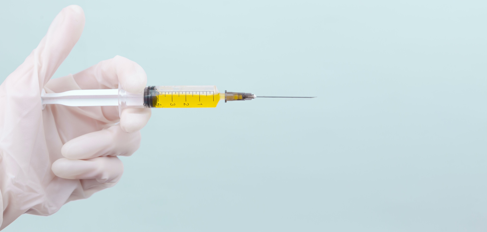

Há um risco à espreita de quem reflete sobre o próprio desenvolvimento, de quem se interessa por produtividade, de quem deseja lapidar-se com o tempo. Incomodar-se é importante, não me entenda mal – muito embora, enquanto não gerar atos concretos, não é ainda virtude alguma — mas há, sim, um risco.

O risco de se achar suficiente.

<i>"Quem é você? Diga logo, que eu quero saber." – Somos barro. O barro mais amado do universo; mas, ainda, barro.</i>

## Apenas a partilha de um jovem pai

Quero, aqui, somente compartilhar algo que me ocorreu esses dias. Como mencionei num *story* do [Instagram](https://www.instagram.com/g.boaviagem/), meu filho pequeno passou por uma pequena cirurgia. O fato aconteceu na segunda noite no hospital, que foi bastante desafiadora.

Rafael tem apenas 1 ano e 3 meses e, impaciente e incomodado, chorava muito. Embora ainda tome o leite materno, não se contentava em mamar. O colo não o acalmava. Mais que o cansaço, nos doía vê-lo sem consolo. Após um bom tempo de choro, caía no sono pesado, para acordar entre 30min e 1h depois.

Ele ainda carregava nas costas da mão esquerda um acesso venoso, por onde recebia, embora reclamando, analgésicos e antibióticos periodicamente. Como os médicos viram, na manhã anterior, que ele estava bastante agitado e se debatendo muito, por medo, tomaram a precaução de envolver o acesso com faixas e uma tala, criando uma luva rígida. Foi uma ótima ideia, por sinal.

Só que, com as brincadeiras e movimentos do dia, essa "luva" estava escorregando. Naquela noite, de madrugada, o dedão até já estava fora. Se perdêssemos o acesso, seria preciso criá-lo novamente na manhã seguinte – um pequeno sofrimento a mais para Rafa.

Naquela hora da noite, ele estava mamando, recebendo o antibiótico pelo acesso. Tinha adormecido, tomado pelo cansaço, mas frequentemente movimentava o braço para lá e para cá, afrouxando mais as faixas do acesso. **Não havia nada mais que pudéssemos fazer, a luva iria cair**. Quando visse o acesso desvelado, preso à mão por esparadrapos, certamente Rafael iria querer tirar. Eu iria chamar a enfermeira para reatar as faixas, mas precisaríamos segurar um Rafael se debatendo, aos berros, sabe-se lá por quanto tempo. E sabe-se lá como ficaria essa luva.

> Em retrospecto, vejo que a situação parecia objetivamente pouco grave. Tínhamos as enfermeiras à disposição. Mas, como pais, não nos basta garantir a saúde física do filho e saber que ele ainda sofrerá psicologicamente.

Resolvemos chamar a enfermeira naquele instante, enquanto ele dormia um sono que, segundo nossa impressão, era leve. Eis que veio Sandra.

## A solução não vem por mim. Por que viria?

Sandra demonstrava uma empatia e cuidado fora do comum. Pedindo para acender apenas uma luz de penumbra, ela vagarosamente retirou a conexão do soro, tão logo a dose acabou, e pôs-se a desenfaixar a "luva" para tentar reatá-la ainda com Rafael dormindo. Rezei para que ele não acordasse.

Sandra gentilmente desfez uma, duas, três voltas da faixa, segurando a mão mole de Rafa, e ele não acordou. Ela reposicionou a tala devagar e começou a enfaixar. Alternando voltas na mão, com voltas no meio do antebraço, com voltas intermediárias. Cortou um esparadrapo em silêncio e colou sobre as pontas da faixa.

E conseguiu. Rafa estava com o acesso protegido novamente sob faixas reatadas no abraço e... ainda dormia.

## Não se desespere em face ao que não pode controlar

Há uma expressão, [atribuída a Santo Inácio de Loyola](https://www.vatican.va/content/benedict-xvi/pt/angelus/2012/documents/hf_ben-xvi_ang_20120617.html), que diz
> ##### "Aja como se tudo dependesse de você, sabendo bem que, na realidade, tudo depende de Deus"
> cf. Pedro de Ribadeneira, Vida de S. Inácio de Loyola, Milão, 1998.

Ela representa bem como deve ser a postura diante das provações e incertezas da vida. Creia você em Providência Divina ou não, o fato é que devemos sempre dar nosso melhor para nos precaver, nos fortalecer, resistir, superar, estar sempre prontos, mas sabendo que **não somos autossuficientes**.

Aqui estão memórias e reflexões que me marcaram. Hoje eu vim desprovido de livros ou referências, munido apenas de uma partilha, porque senti necessidade de dividir isso. No fim, importa continuarmos a jornada diária com a determinação de dar nosso melhor naquilo que está a nosso alcance, mas sabendo que há muitas coisas que nos fogem ao controle. E está tudo bem.
